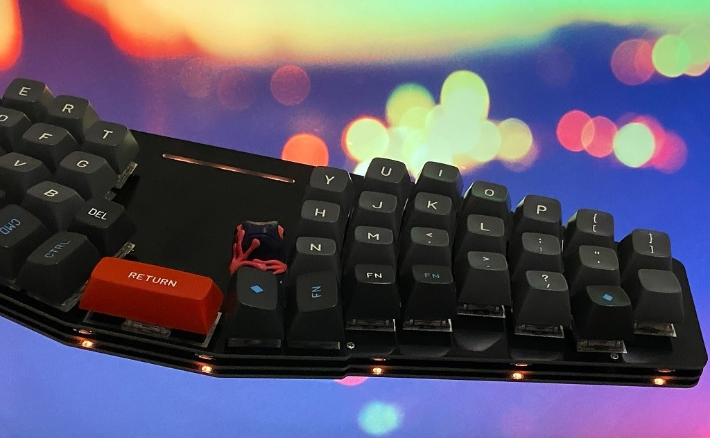

# Ergotonic-49 Spirit of the Willow
 
現在は日本語による情報のみ掲載しています。

## 自作キーボードキット Ergotonic-49 

- いわゆる40%キーボード。合計49キー(エクストラとして更に+1キー)
- 一体型だけど分離型。分離型だけど非分割。ちょうど扱いやすいサイズ感
- 細身のスタイリッシュな外観
- Row staggeredと Column staggeredが融合したような独特なカーブを持つWillow配列を採用
- すっと指を伸ばすとそこに自然にキーがある不思議な感覚
- 最大3つのロータリーエンコーダに対応
- 3つのモード指示兼装飾用のフルカラーLED
- オプションでアンダーグローLEDに対応
- Cherry MK互換キースイッチ対応
- キースイッチを組み立て後にも取り替え可能なホットスワップを採用
- 3層サンドイッチ構造でオーソドックスな組み立て方式
- ProMicroとQMK firmware

## キットの入手先

[BOOTH hanachi-ya](https://hanachiya.booth.pm/items/3040189)

## ビルドガイド

  [Erogotonic 49 ビルドガイド](docs/buildguide.md)

## ファームウェア

 - ソースコード
   
   https://github.com/hanachi-ap/qmk_firmware/tree/ergotonic49/keyboards/ergotonic49

- hexファイル

   [ergotonic49_default.hex](lib/ergotonic49_default.hex)

- VIA用jsonファイル
  
  [ergotonic49_via.json](lib/ergotonic49_via.json)
