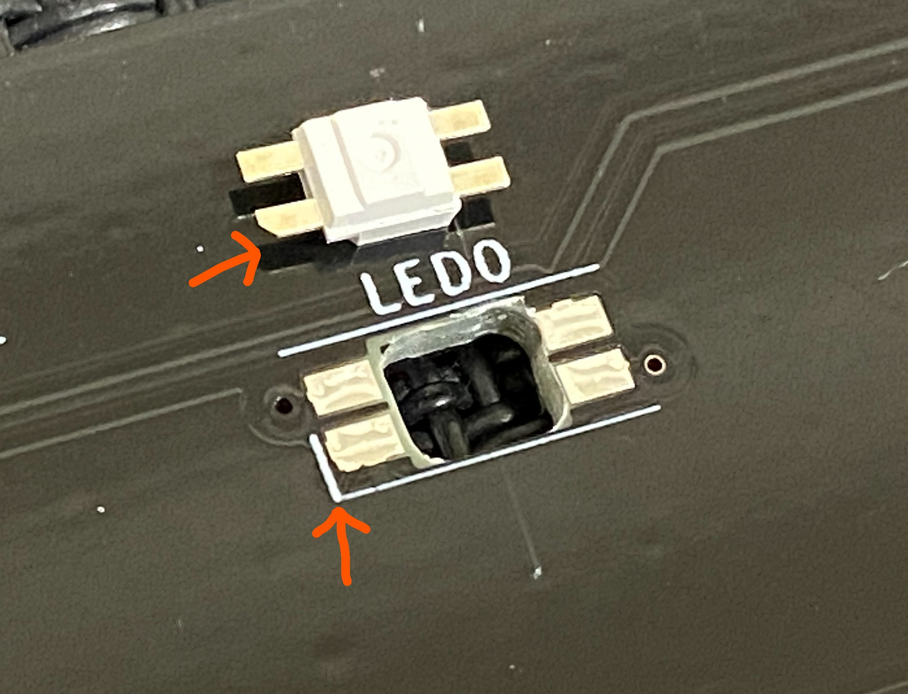
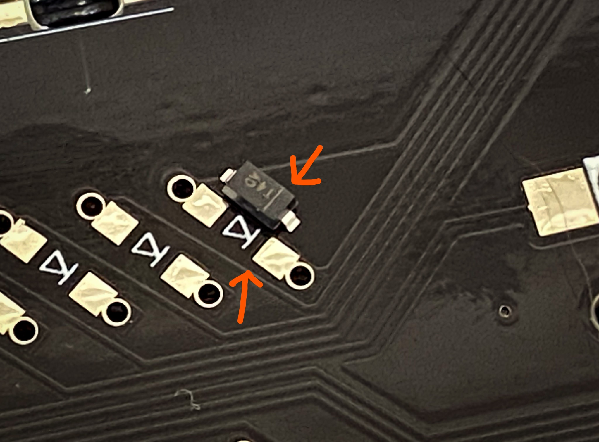
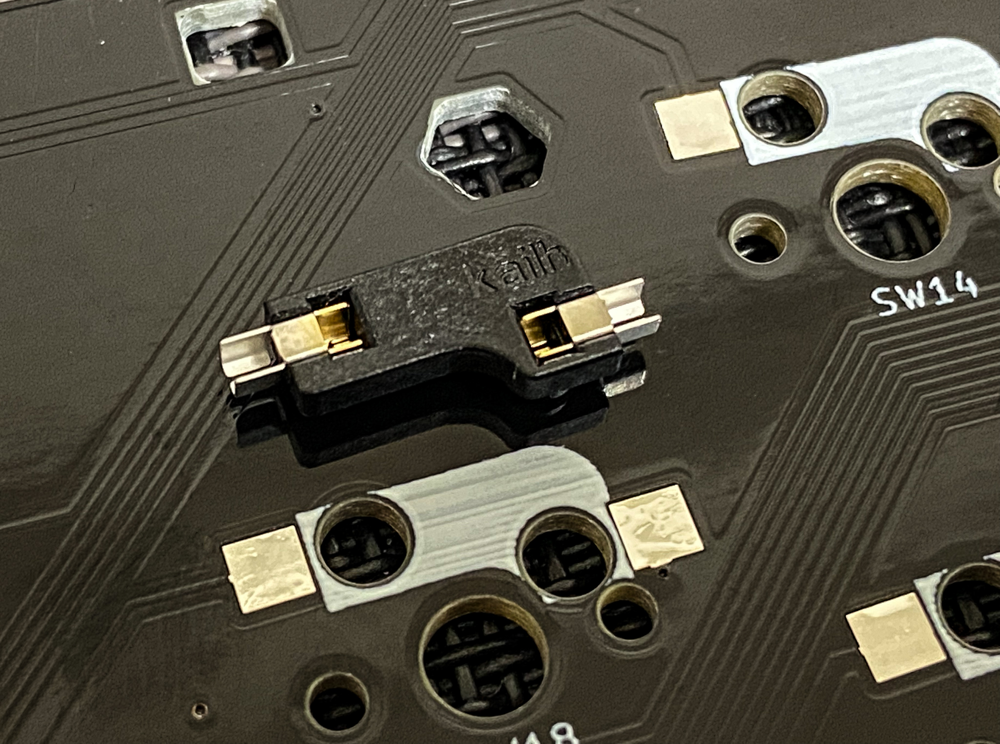
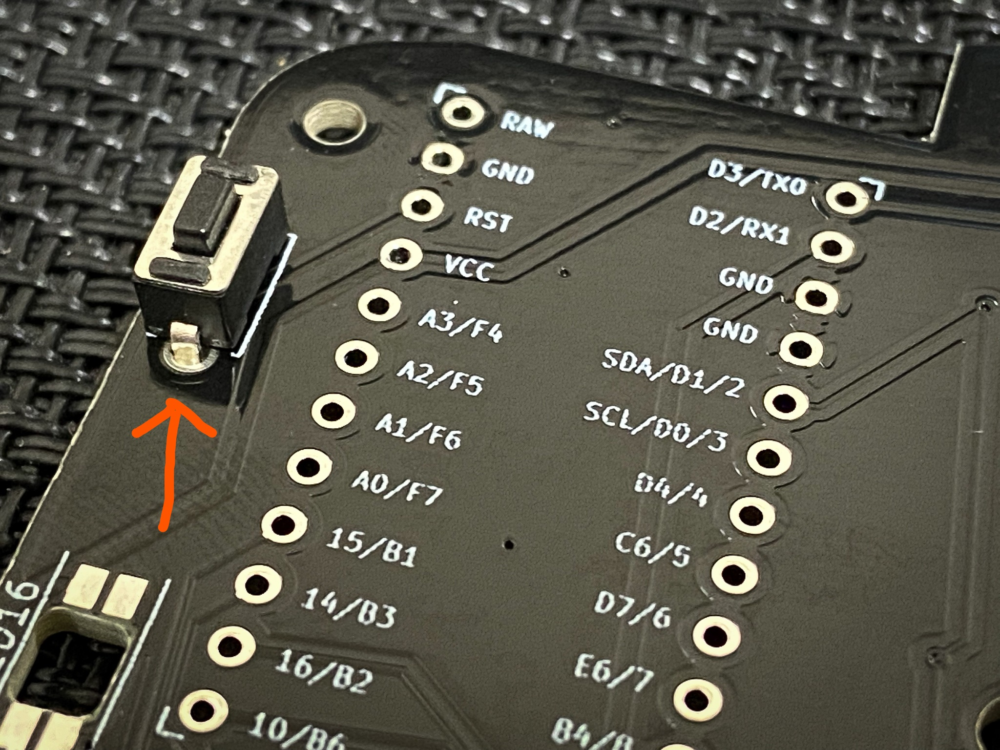

[<<Prev: ProMicroの準備](02_promicro.md)  

# 3. PCBへのパーツ取り付け

PCBへのパーツを取り付ける際には、PCBの表裏に注意して下さい。

   

## RGB LEDをはんだ付けする

モードインジケータ兼装飾用のLEDをはんだ付けします。

- PCBの裏面のLED0、LED1、LED2とシルク印刷されている3ヶ所に取り付けます。
  - PCBの裏側から、光る面が表側になるように配置します。
  - LEDには極性があります。LEDの足が欠けている方向をシルクの印に合わせます。
  
  

-  LEDの4ヶ所の足をはんだ付けします。
- アンダーグロー用LEDを取り付ける場合は、続けて LED3～LED16までをPCB表側から取り付けます。

NOTE:

 - LEDの表裏、方向を間違わないよう気をつけて下さい。
 - RGB LEDは熱に弱いため、高温で長時間はんだ作業をしないよう注意して下さい。

## ダイオードをはんだ付けする

電流の流れを制御するダイオードをはんだ付けします。

- ダイオードはPCBの裏面から取り付けます。
- ダイオードには極性があります。LEDに薄い線が印刷されている方向(カソード)をPCBシルクに合わせて配置します。
  
   

- 両端2ヶ所をはんだ付けします。

NOTE:

 - ダイオードの方向を間違わないよう気をつけて下さい。
 - キーが反応しないというトラブルの多くはダイオードのハンダ不良に起因します。はんだ付けの後に目視確認をしっかり行って下さい。
   - ハンダを忘れている部分がないか
   - はんだ付け不良の部分はないか
   - ダイオードの方向に間違いはないか
 
TIPS:

- SMD型ダイオードのはんだ付けのコツ
  - PCBのパッドの片方に予備ハンダを盛ります
  - 予備ハンダを溶かしつつピンセットでダイオードを所定の位置に送ります
  - 反対側をはんだ付けします
  - 予備ハンダをした方をもう一度はんだ付けします

- スルーホールタイプのダイオードにも対応しています。

## スイッチソケットをはんだ付けする

キースイッチを取り外し可能にするソケットをはんだ付けします。

- PCBの裏面からシルクに合わせて取り付けて、2ヶ所をはんだ付けします。
  
  

## リセットスイッチをはんだ付けする

- PCBの表側からタクトスイッチを取り付けます(極性はありません)
- PCBの裏側からはんだ付けします
  
  

## ロータリーエンコーダーを取り付ける

- ロータリーエンコーダーはRE1, RE2, RE3のシルク表記がある箇所に取り付けることができます。
- PCBの表側からパーツを取り付け、裏側をはんだ付けします。

----
 [>>Next: 組立前の動作確認](04_operation_check.md)

[Index](index.md)
