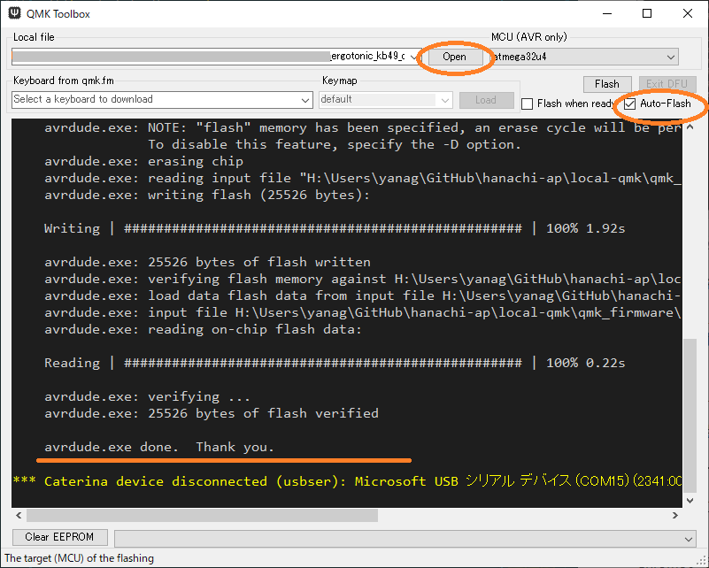
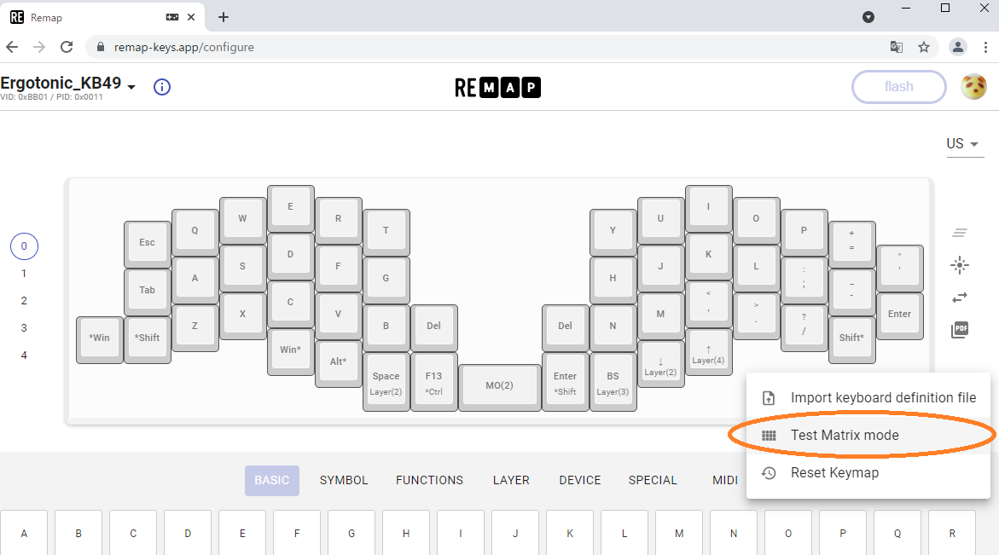

[<<Prev: PCBへのパーツ取り付け](03_soldering_pcb.md)  
----

# 組立前の動作確認

## ProMicroを取り付ける

PCBの表側からProMicroを取り付けます。

## ファームウェアを書き込む
ダウンロードしておいたファームウェアをProMicroに書き込みます。

- PC側のQMK Toolboxで書き込みを準備します
  - PC上で QMK Tookboxを起動します
  - Openボタンをクリックし、入手したファームウェアファイルを指定します。
  - Auto-Flashの部分をチェックします
- USBケーブルでPCとProMicroを接続します。
- キーボード側のリセットスイッチ押します。
-  QMK Toolbox上で書き込みログが表示されるので正常に完了することを確認します
 
   

## LEDの点灯確認

ファームウェアの書込みができた時点でLEDが点灯する設定となっています。
取り付けたすべてのLEDが 赤-緑-青に交互に点灯することを確認します。

トラブルシュート
  - [LEDが点灯しない](LEDが点灯しない)
  
## キーが反応することを確認する

全体を組み立てる前にはんだ付けに問題がないかをこの時点で確認します。

Chromeブラウザで[REMAPサイト](https://remap-keys.app/configure)を開きます。

- Ergotonic_49 という名称で認識され、キーマップ定義画面が開きます。
- 画面右側の  '...' メニューから "Test Matrix mode"に移ります。
- PCBにはんだ付けしたソケットにピンセットの先を差し込んでキーが押された状態を再現します。
- 画面上でキーが押された状態になったことを確認します

  

トラブルシュート:
  - [キーが反応しない](#キーが反応しない)

----
 [>>Next: 組み立て](05_assembly.md)
