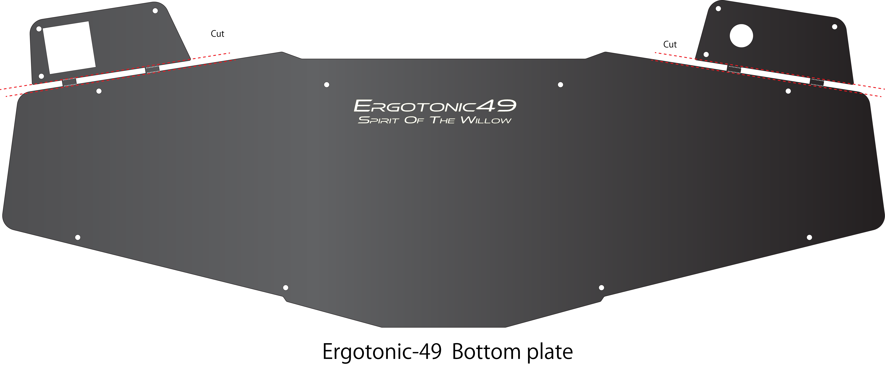
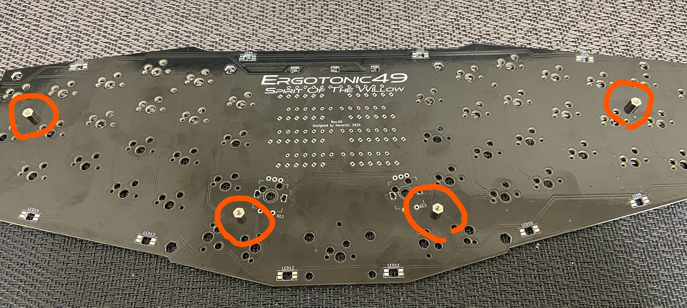
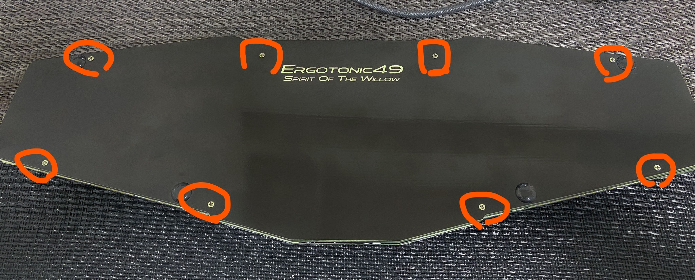

[<<Prev: 組立前の動作確認](04_operation_check.md)  

# 5. 組み立て

## 保護プレートの切り離し

ボトムプレートに耳のように付いている保護カバーを切り離します。

  

- カッターナイフと定規で切り離し用の微細な穴が空いている箇所を、軽くなぞって切り込みを入れます
- ラジオペンチで掴んで折り曲げて切り離します
- ヤスリで端面を整えます

TIPS:
 
 - 保護カバーはスイッチ用とロータリーエンコーダ用の2種類があるので必要な方を利用して下さい。

NOTE:

 - 傷がつかないように注意
 - 削りすぎに注意

## スタビライザーを取り付ける

中央の部分に2Uスタビライザーを取り付けます

## PCBとトッププレートを結合する

- PCBにスペーサー(短)を4ヶ所ネジ止めします
  - 写真の位置に、表側にスペーサーを配置し裏側からネジ止めします。
  - トッププレートを重ね、表側からも4ヶ所ネジ止めします。
  

## PCBと保護プレートを結合する

- トッププレートの表側から、写真の位置にスペーサー(長)を配置し、PCBの裏側からネジ止めします
- 保護プレートを重ねて上から3ヶ所ネジ止めします。

  

## ボトムプレートを結合する

- 全体を裏返し、6角形の穴の部分にスペーサー(長)を8本差し込みます
- トッププレート側からネジ止めします
- ボトムプレートを重ね8ヶ所ネジ止めします
  
  

TIPS:
 - ボトムプレートはどちらの面も使用できます。お好きな面を使って下さい。

## ゴム足を取り付ける

- 裏側からゴム足を4箇所に取り付けます

----
 [>>Next: 最後のステップ](06_final_step.md)

[Index](index.md)
