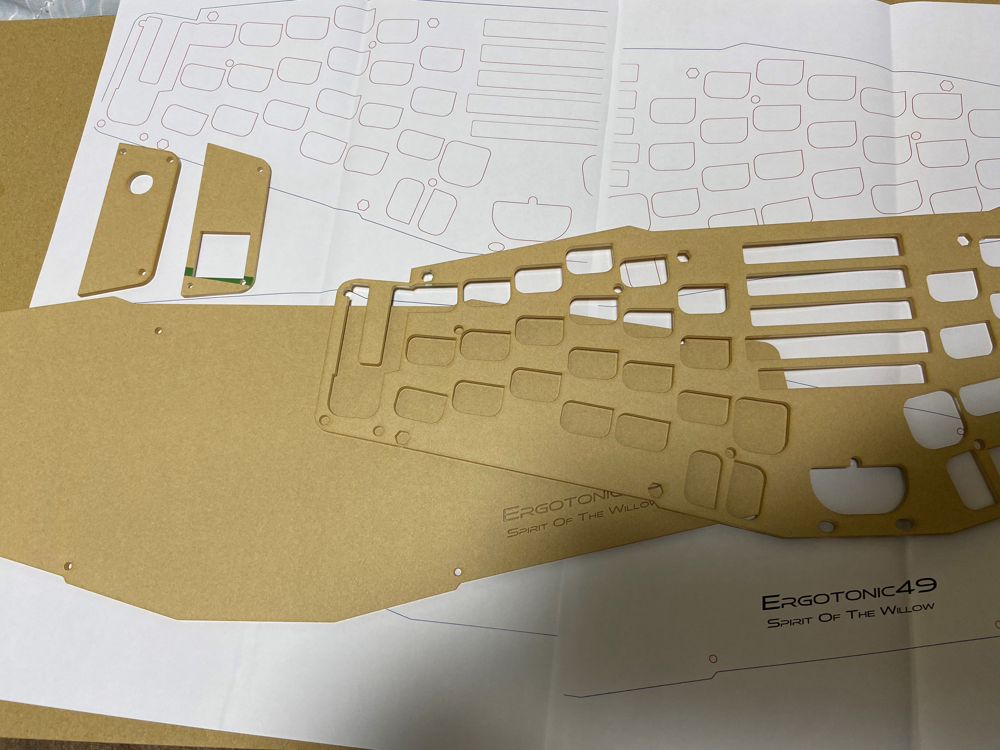

# Ergotonic49アクリルディフューザー

## これは何?

Ergotonic49のボトムプレートをアクリルに置き換えて
アンダーグローLEDがきれいに見えるようにするための加工データです。

利用したい方はデータをダウンロードして、自分でレーザー加工機でカットするか、アクリル加工サービスに加工を委託してください。

## レーザカット用加工データ
  
 - [Ergotonic49 Acrylic Diffuser data(Adobe Illustrator)](../lib/ergotonic49_acrylic_diffuser.zip)

## 加工時のレギュレーション
   
 -  加工用アクリルプレートサイズ 
    - アクリル押出材 450mm x 300mm x 2mm
   
- カラーはお好みになりますが、クリア、もしくはマットクリアあたりが無難なお勧めとなります

## 取り付け時の注意
- リセット用のタクトスイッチは、裏側にはみ出ている足を平らになるようにカットしてください。

## ギャラリー

準備中
  

  

----

[Index](index.md)
