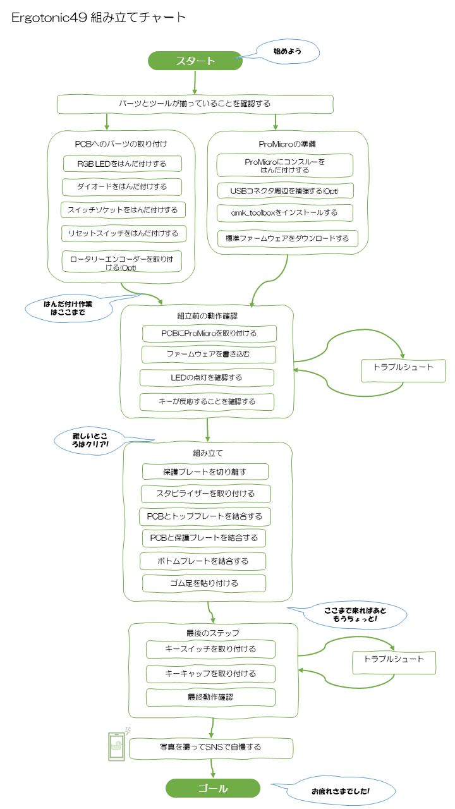
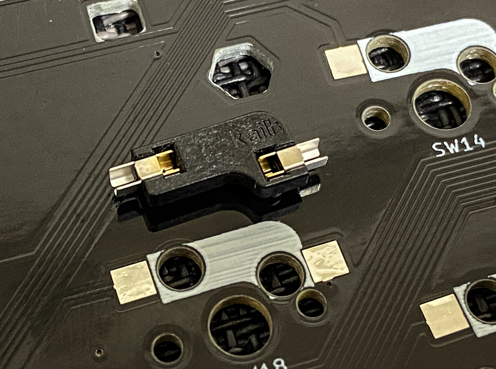
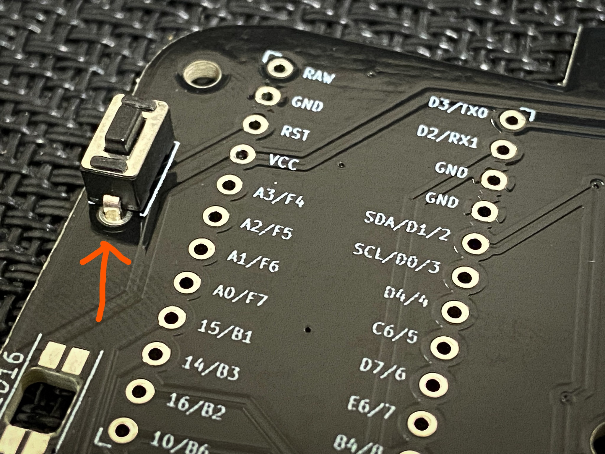
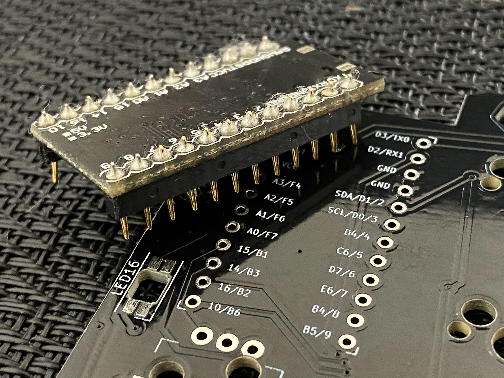
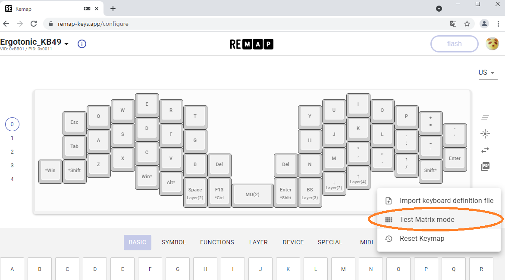
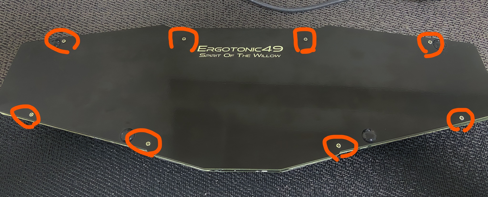

# Ergotonic-49 組み立て説明書

Ergotonic-49のビルドガイドです。

## 組み立て手順 (全体チャート)

## 準備
組み立てを始める前に、パーツおよびツールが揃っていることを確認します。

### キット添付品

|品名                   | 数量 |備考|
|:----------------------|----:|:---|
|プリント基板            | 1枚 |  |
|トッププレート          | 1枚 |   |
|ボトムプレート          | 1枚  |保護プレート 一体  |
|ネジ                    |30本 | M2 3mm  |
|スペーサー(長)           |11個 |  M2 7mm  |
|スペーサー(短)           | 4個  | M2 3.5mm   |
|ダイオード              |50個 | SMDタイプ  |
|RGB LED                | 3個 |SK6812MINI-E   |
|スイッチソケット        | 50個 |MX互換   |
|タクトスイッチ          |  1個 |   |
|ゴム足                 | 4個 |   |

### キット以外に用意するもの

|品名                   | 数量 |備考|
|:----------------------|----:|:---|
| ProMicro(コンスルー付き) | 1個| |
| MX互換スイッチ          | 50個| |
| キーキャップ (1Uサイズ)  | 45個| |
| キーキャップ (1.25Uサイズ)  | 4個| |
| キーキャップ (2.25Uサイズ)  | 1個| 2Uサイズでも代用可 |
| スタビライザー(2Uサイズ)  | 1個|オプション|
| アンダーグロー用RGB LED (SK6812MINI-E)  | 14個| オプション|
| ロータリーエンコーダー| 最大3個| オプション|

オプションと表記しているパーツは無くてもキーボードとしての機能は満足します。お好みに応じて準備して下さい。

ロータリーエンコーダーは特定のキースイッチと排他で最大3個搭載できます。Alps EC12シリーズ互換のものを準備下さい。
日本国内で簡単に手に入るものとしては、
[遊舎工房(ロータリーエンコーダ(ノブ付き)](https://shop.yushakobo.jp/collections/keyboard-parts/products/pec12r-4222f-s0024)、
[秋月電子通商 【P-06357】ロータリーエンコーダ](https://akizukidenshi.com/catalog/g/gP-06357/)
で動作を確認しています。

### ツール
 - 糸ハンダ
 - はんだごて、および周辺ツール(コテ台、スポンジ、ハンダ吸い取り線、フラックス、フラックス洗浄剤等)
 - ピンセット
 - 精密ドライバ(プラス No.0)
 - ラジオペンチ
 - カッターナイフ、定規、ヤスリ (PCB切り離し用) 
 - テスター (必要に応じて)
 - エポキシ系接着剤(必要に応じて)

## ファームウェア書込み環境の準備

#### QMK Toolboxをインストールする

QMK Toolboxは、ファームウェアをマイコン(ProMicro)へ書き込むために必要となります。 (既に環境がある方はこの作業は不要です)

下記サイトから QMK Toolboxをダウンローして自身のPCへインストールします。

  - [https://github.com/qmk/qmk_toolbox/releases](https://github.com/qmk/qmk_toolbox/releases)

インストール方法はサイトの情報に従ってください。必要に応じてドライバもインストールします。

#### 標準ファームウェアをダウンロードする

下記URLからファイルをダウンロードして下さい。

  - [Ergotonic49 Default keymap](../lib/ergotonic49_default.hex)

## 組み立て手順(詳細)

### PCBへのパーツ取り付け

#### RGB LEDをはんだ付けする

モードインジケータ兼装飾用のLEDをはんだ付けします。

- PCBの裏面のLED0、LED1、LED2とシルク印刷されている3ヶ所に取り付けます。
  - PCBの裏側から、光る面が表側になるように配置します。
  - LEDには極性があります。LEDの足が欠けている方向をシルクの印に合わせます。
  
-  LEDの4ヶ所の足をはんだ付けします。

- アンダーグロー用LEDを取り付ける場合は、続けて LED3～LED16までをPCB表側から取り付けます。

NOTE:
 - LEDの表裏、方向を間違わないよう気をつけて下さい。
 - RGB LEDは熱に弱いため、高温で長時間はんだ作業をしないよう注意して下さい。

#### ダイオードをはんだ付けする

電流の流れを制御するダイオードをはんだ付けします。

- PCBの裏面から取り付けます。
  - ダイオードには極性があります。LEDに薄い線が印刷されている方向(カソード)をPCBシルクに合わせて配置します。
  - 

- 両端2ヶ所をはんだ付けします。

NOTE:
 - ダイオードの方向を間違わないよう気をつけて下さい。
 
TIPS:
- SMD型ダイオードのはんだ付けのコツ
  - PCBのパッドの片方に予備ハンダを盛ります
  - 予備ハンダを溶かしつつピンセットでダイオードを所定の位置に送ります
  - 反対側をはんだ付けします
  - 予備ハンダをした方をもう一度はんだ付けします
- キーが反応しないというトラブルの多くはダイオードのハンダ不良に起因します。はんだ付け終了後に目視確認をしっかり行って下さい。
  - ハンダを忘れている部分がないか。はんだ付け不良の部分はないか。
  - ダイオードおの方向に間違いはないか
- スルーホールタイプのダイオードにも対応しています。

#### スイッチソケットをはんだ付けする

キースイッチを取り外し可能にするソケットをはんだ付けします。

- PCBの裏面からシルクに合わせて取り付けて、2ヶ所をはんだ付けします。
  

#### リセットスイッチをはんだ付けする

- PCBの表側からタクトスイッチを取り付けます(極性はありません)
- PCBの裏側からはんだ付けします

#### ロータリーエンコーダーを取り付ける

- ロータリーエンコーダーはRE1, RE2, RE3のシルク表記がある箇所に取り付けることができます。
- PCBの表側からパーツを取り付け、裏側をはんだ付けします。

### ProMicroの準備

キーボードに搭載するマイコン ProMicroの準備を行います。

#### ProMicroにコンスルーをはんだ付けする

- スプリングピンヘッダの足の長い方をPCBのスルーホールへ差し込みます。
- ProMicroの部品が実装してある面が内側に隠れるような向き(平らな面が見える向き)でピンヘッダに差し込みます
- ProMicro側のピンヘッダをはんだ付けします。
  

NOTE
- PCB側のピンヘッダははんだ付けしません。はんだ付けするのはProMicro側だけです。
- ProMicroの表裏を間違えるとリカバリが非常に大変ですのではんだ付けの前に向きに注意ください。

TIPS:
 - [ProMicroへコンスルーの取り付け方(遊舎工房)](https://yushakobo.zendesk.com/hc/ja/articles/360044233974-%E3%82%B3%E3%83%B3%E3%82%B9%E3%83%AB%E3%83%BC-%E3%82%B9%E3%83%97%E3%83%AA%E3%83%B3%E3%82%B0%E3%83%94%E3%83%B3%E3%83%98%E3%83%83%E3%83%80-%E3%81%AE%E5%8F%96%E3%82%8A%E4%BB%98%E3%81%91%E6%96%B9%E3%82%92%E6%95%99%E3%81%88%E3%81%A6%E4%B8%8B%E3%81%95%E3%81%84)

#### USBコネクタ周辺を補強する(オプション)

ProMicroのUSBコネクタは強度が弱いことが知られています。
対策としてProMicroのUSBコネクタ部分をエポキシ系接着剤の樹脂で強化します。
 -  エポキシ系接着剤の説明書の指示通りに調合し、爪楊枝の先などで慎重にUSBコネクタ周辺に盛り付けます。
 - 樹脂が硬化するまで安静にします。

TIPS:
  - [もげマイクロ対策(Google search)](https://www.google.com/search?client=firefox-b-d&q=%E3%82%82%E3%81%92%E3%83%9E%E3%82%A4%E3%82%AF%E3%83%AD)

### 組立前の動作確認

#### ProMicroを取り付ける

PCBの表側からProMicroを取り付けます。

#### ファームウェアを書き込む
ダウンロードしておいたファームウェアをProMicroに書き込みます。

- PC側のQMK Toolboxで書き込みを準備します
  - PC上で QMK Tookboxを起動します
  - Openボタンをクリックし、入手したファームウェアファイルを指定します。
  - Auto-Flashの部分をチェックします
- USBケーブルでPCとProMicroを接続します。
- キーボード側のリセットスイッチ押します。
-  QMK Toolbox上で書き込みログが表示されるので正常に完了することを確認します

#### LEDの点灯確認

ファームウェアの書込みができた時点でLEDが点灯する設定となっています。
取り付けたすべてのLEDが 赤-緑-青に交互に点灯することを確認します。

トラブルシュート
  - [LEDが点灯しない](LEDが点灯しない)
  
#### キーが反応することを確認する

全体を組み立てる前にはんだ付けに問題がないかをこの時点で確認します。

Chromeブラウザで[REMAPサイト](https://remap-keys.app/configure)を開きます。

- Ergotonic_49 という名称で認識され、キーマップ定義画面が開きます。
- 画面右側の  '...' メニューから "Test Matrix mode"に移ります。
- PCBにはんだ付けしたソケットにピンセットの先を差し込んでキーが押された状態を再現します。
- 画面上でキーが押された状態になったことを確認します

トラブルシュート:
  - [キーが反応しない](#キーが反応しない)

### 組み立て

#### 保護プレートの切り離し

ボトムプレートに耳のように付いている保護カバーを切り離します。

保護カバーはスイッチ用とロータリーエンコーダ用の2種類があるので必要な方を利用して下さい。

- カッターナイフと定規で切り離し用の微細な穴が空いている箇所を、軽くなぞって切り込みを入れます
- ラジオペンチで掴んで折り曲げて切り離します
- ヤスリで端面を整えます
  
NOTE:
 - 傷がつかないように注意
 - 削りすぎに注意

#### スタビライザーを取り付ける

中央の部分に2Uスタビライザーを取り付けます

#### PCBとプレートを結合する

- PCBにスペーサー(短)を4ヶ所ネジ止めします
  - 写真の位置に、表側にスペーサーを配置し裏側からネジ止めします。
  - プレートを重ね、表側からも4ヶ所ネジ止めします。

#### PCBと保護プレートを結合する

- プレートの表側から、写真の位置にスペーサー(長)を配置し、PCBの裏側からネジ止めします
- 保護プレートを重ねて3ヶ所ネジ止めします。

#### ボトムプレートを結合する

- 全体を裏返し、6角形の穴の部分にスペーサー(長)を8本差し込みます
- プレート側からネジ止めします
- ボトムプレートを重ね8ヶ所ネジ止めします

#### ゴム足を取り付けます

- 裏側からゴム足を4箇所に取り付けます

### 最後のステップ

#### キースイッチを取り付ける

キースイッチをプレート側から取り付けます。

NOTE
 - 親指周辺のキースイッチは90度回転しているので注意して取り付けて下さい
  - キースイッチを取り付ける際にはまっすぐ上から慎重に差し込むようにします。
  - スイッチのピンは曲がりやすいので注意してください。 ピンが曲がったまま無理矢理取り付けるとそのキーは反応しなくなります。
  - ピンが曲がってしまった場合でも、一度引き抜いてラジオペンチの先端で慎重に伸ばせばリカバリ可能です。

#### キーキャップを取り付ける

お好きなキーキャップ取り付けます。

#### 最終動作確認

最後の確認を行って完成です。
- すべてのキーが反応すること
- すべてのLEDが点灯すること

TIPS:
  - LEDがテストモードで動作しているのを止めたい場合下記のいずれかの方法で行って下さい
     - 1 REMAPのLED ”Lightning"設定でお好みのモードに変更する
     - 2 下記のキーの組み合わせでOFF またはモードを変更する
      
## トラブルシュート

### LEDが点灯しない

  - RGB LEDは複数のLEDが数珠つなぎになっていて、途中で不良のLEDがあるとそれ以降のLEDがすべて点灯しなくなる特徴があります。
  点灯しないLEDおよびその一つ前のLEDをよく調べて下さい。
    - LEDの取り付け方向が正しいか
      - LEDの切り欠きのある足と、PCBのシルクの方向が合っているか
      - 方向が間違いがあるとすべての機能が動かなくなる事があるので注意
    - LEDのハンダ不良はないか
  
### キーが反応しない

- 特定のキーが反応しない
 
  大抵の場合は下記の原因が考えられるので落ち着いて調べます
     -   キースイッチのピン(足)が折れ曲がっていないか
     -   ダイオードの向きが逆でないか
     -   ダイオードのはんだ付け不良はないか
     -   キーソケットのはんだ付け不良はないか
     -   そもそも、そのキーにキーコードが割り当てられていない(レイヤー切り替え等)

- どのキーも反応しない
     - PCとキーボードが正しくUSBで接続されているか。
       通電するとProMicro表側に実装されたLEDが点灯します。
     - ProMicroにも正しくファームウェアが書き込まれているか。
     - ProMicroのはんだ付け不良はないか
     - ProMicroのピンヘッダが曲がっていないか
     - LEDのいずれかの取付方向が間違っている(ProMicroが正常に動作していない)

### その他
 - ダイオードを無くしてしまった
  
   通販サイトで入手可能です。 高速スイッチング・ダイオード1N4148W を購入してください。

## 参考情報

### パーツショップ(日本)

自作キーボードの代表的なショップを列挙します(順不同)。前述のみ立てキット以外に必要な部品は下記ショップでほぼ揃います。

- 遊舎工房 (https://yushakobo.jp/)
- TALP KEYBOARD (https://talpkeyboard.stores.jp/)
- ゆかりキーボードファクトリ (https://eucalyn.shop/)
- Kochi Keyboard (https://kochikeyboard.stores.jp/)

- 秋月電子通商 (https://akizukidenshi.com/catalog/default.aspx)
### はんだ付け技能
下記以外にも様々なテクニックやノウハウが公開されているので、検索サイトで調べるようにしてください。

- [電子工作のコツ/はんだ付け ](https://article.murata.com/ja-jp/article/soldering)村田製作所
- [ハンダ付け職人のはんだ付け講座](https://godhanda.co.jp/blog/category/handakouza/soldering%E3%80%80guide/)ゴッドはんだ株式会社
- [表面実装部品（SMD）のはんだ付け](https://www.kogadenshi.co.jp/%E5%8D%8A%E7%94%B0%E4%BB%98%E3%81%91%E3%83%86%E3%82%AF%E3%83%8B%E3%83%83%E3%82%AF/%E8%A1%A8%E9%9D%A2%E5%AE%9F%E8%A3%85%E9%83%A8%E5%93%81-smd-%E3%81%AE%E5%8D%8A%E7%94%B0%E4%BB%98%E3%81%91/) 株式会社古賀電子
