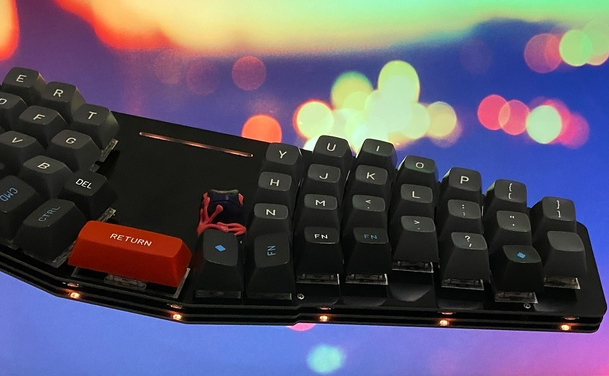

# Ergotonic49 Spirit of the Willow
 
[English pages](https://translate.google.com/translate?hl=&sl=ja&tl=en&u=https%3A%2F%2Fhanachi-ap.github.io%2Fergotonic49_docs%2F&sandbox=1)

## 自作キーボードキット Ergotonic49 

Ergotonic49は 40%一体型メカニカルキーボードの組み立てキットです。

- 一体型だけど分離型。分離型だけど非分割

  数字行を省いた40%に分類されますが、最大50キーで日常使いにちょうどよいサイズ感。
  
- Willow配列採用

  手指の自然な動きに優しくフィットするキー配列が特徴。
  すっと指を伸ばすとそこに自然にキーがある不思議な感覚です。

- REMAP対応

  ブラウザから簡単にキーマップをカスタマイズできるのでファームウェアの開発環境は不要です

- Cherry MK互換キースイッチ対応

  ホットスワップ対応で後から好みのキースイッチに付け替えることができます。

- 最大3つのロータリーエンコーダ

  ボリューム、ズーム、スクロールなど自在に設定ができます。

- フルカラーLED

  キーボード中央には各種LOCKステータスの表示を兼ねて装飾用フルカラーLEDを配置。
  オプションでキーボード下部を照らすアンダーグローにも対応。(LEDは別途調達要)

- 3層サンドイッチ構造

  オーソドックスな組み立て方式です

- ProMicroとQMK firmware

## キットの入手先

日本国内では下記から購入できます。海外への転送サービスも利用できるはずですので検討ください。

 - [BOOTH hanachi-ya](https://hanachiya.booth.pm/items/3040189)

 - [遊舎工房](https://shop.yushakobo.jp/collections/keyboard/products/2942)

## ビルドガイド

キーボードの組み立て方はこちらを参照してください

 -  [Erogotonic 49 ビルドガイド](https://hanachi-ap.github.io/ergotonic49_docs/docs/)

## ファームウェア

 - ソースコード
   
     [hanachi-ap / qmk_firmware](https://github.com/hanachi-ap/qmk_firmware/tree/ergotonic49/keyboards/ergotonic49)

   公式にはマージしていないので上記リポジトリをcloneあるいはforkなどして下さい。

- hexファイル

   [ergotonic49_default.hex](lib/ergotonic49_default.hex)    (ロータリーエンコーダVIA対応バイナリです)

   [ergotonic49_default_v1.hex](lib/ergotonic49_default_v1.hex)    (前バージョンのバイナリ)

- 標準キーマップ
  
   チートシート [keymap_cheatsheet_ergotonic_49.pdf](docs/img/keymap_cheatsheet_ergotonic_49.pdf)

- REMAP
  
  REMAP公式にマージ済み。

  ブラウザで [REMAPサイト](https://remap-keys.app/) にアクセスするだけで簡単にキーマップやLED表示が設定できます。

- VIA用jsonファイル
  
    [ergotonic49_via.json](lib/ergotonic49_via.json)

    VIAを利用する場合は上記ファイルを読み込ませて下さい。

## 物理レイアウト

本体サイズ  359mm x 113mm x 10mm
   
- 実物大レイアウト図 [ergotonic49.pdf](docs/img/ergotonic49.pdf)

## 加工オプション アクリルディフーザー

   
- 加工オプション [アクリルディフューザー](docs/10_acrylic_diffuser.md)
